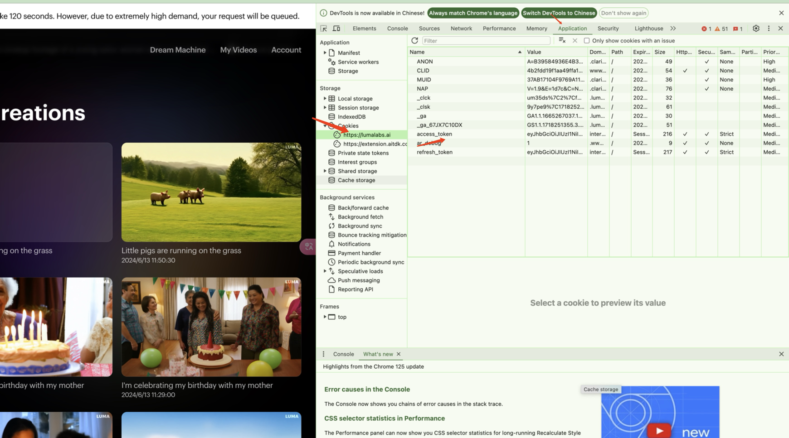
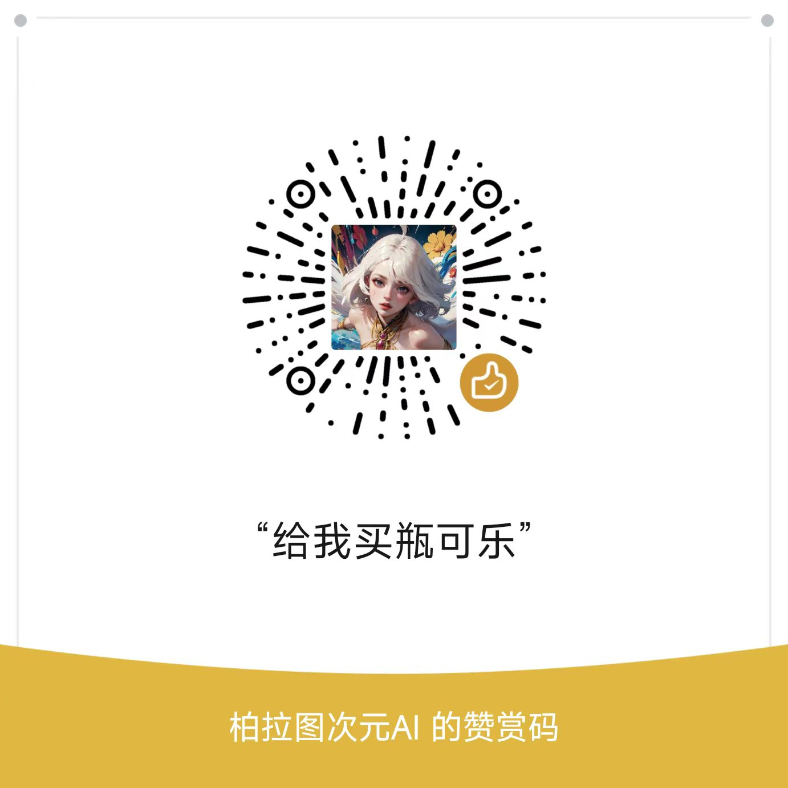

# Luma API
[中文](./README_ZH.md)

Using Golang, convert the video capabilities of the LumaAI Dream Machine into an API format for calls, making it easier to integrate quickly into third-party systems.

## Disclaimer
- This project is released on GitHub under the MIT license, free and open-source for educational purposes.

## Supported Features
- [x] Luma API supports video generation and allows uploading reference images.
- [x] Users can upload reference images in advance or provide third-party image links or base64 encoded images when submitting video tasks.
- [x] API interface security verification.
- [x] Simplified deployment process, supporting both docker-compose and docker.
- [x] Provides standardized services compatible with OpenAI's interface format, supporting both streaming and non-streaming output.
- [x] Supports customization of the OpenAI Chat response format based on Go Template syntax.
- [x] Compatible with frontend projects like chat-next-web.
- [] Automatic keep-alive (still lacking access to refresh token interface).
- [] Adapts to intermediary projects like New API.
- [] Pre-detection of sensitive words.


## API Docs

http://localhost:8000/swagger/index.html

#### Request example
```bash
curl --location 'http://localhost:8000/luma/generations/' \
--header 'Authorization: Bearer {SECRET_TOKEN}' \
--header 'Content-Type: application/json' \
--data '{
    "user_prompt": "Increase dynamic",
    "aspect_ratio": "16:9",
    "expand_prompt": true,
    "image_url": "https://api.bltcy.ai/logo.png" 
}'
```

#### Response example
```bash
{
    "created_at": "2024-06-18T14:47:43.318498Z",
    "estimate_wait_seconds": null,
    "id": "a4a8f1ff-e59b-4969-abcb-98b3e16f003e",
    "liked": null,
    "prompt": "Increase dynamic",
    "state": "pending",
    "video": null
}
```

## Deployment

### Configuration
Log in using Google Chrome https://lumalabs.ai/dream-machine/
Get access_token

 


### Env Environment Variables
| env         | description                                                                                                                                | default value                                  |
|-------------|--------------------------------------------------------------------------------------------------------------------------------------------|------------------------------------------------|
| COOKIE      | Cookie obtained from the image above for the Luma account,having either the access_token or the cookie is sufficient.	                     | None                                           | 
| ACCESS_TOKEN | The access_token and cookie obtained from the luma account in the image above; having either the access_token or the cookie is sufficient. | None                                           |
| BASE_URL    | Request API URL for Luma                                                                                                                   | https://internal-api.virginia.labs.lumalabs.ai | 
| PROXY       | HTTP proxy	                                                                                                                                | None                                           | 
| PORT        | Port                                                                                                                                       | 8000                                           | 
| SECRET_TOKEN | Luma API seurity http header Bearer token                                                                                                  | None                                           |
| ROTATE_LOGS | Whether to rotate logs daily	                                                                                                              | Yes                                            | 
| LOG_DIR     | Log output path                                                                                                                            | ./logs                                         | 
| DEBUG       | Whether to enable Debug logging	                                                                                                           | No                                             | 
| PPROF       | Whether to enable Pprof performance analysis, uses port 8005 if enabled	                                                                   | No                                             |
| CHAT_TIME_OUT | Chat request time out                                                                                                                      | 600 s                                          |
| CHAT_TEMPLATE_DIR | Chat template path                                                                                                                         | ./template                                     |


### Docker Deployment
Step-by-step guide on how to run a Docker container with specific environment variables and port mappings. Sensitive details like SQL names, passwords, and IP addresses are replaced with placeholders for this guide.

```bash
docker run --name luma-api -d -p 8000:8000 \
-e COOKIE=xxxx  \
 lumaapi/luma-api
```

docker-compose deployment
```bash
docker-compose pull && docker-compose up -d
```

docker-compose.yml
```bash
version: '3.2'

services:
  sunoapi:
    image: lumaapi/luma-api:latest
    container_name: luma-api
    restart: always
    ports:
      - "8000:8000"
    volumes:
      - ./logs:/logs
    environment:
      - ACCESS_TOKEN=
```

### Local Deployment
- Golang 1.20+

```bash
git clone https://github.com/LumaAI-API/Luma-API.git
cd Luma-API
go mod tidy
```

## License
MIT © [Luma API](./license)

## Buy Me a Coke


This project is open-source on GitHub under the MIT license and is free of charge. If you find this project helpful, please give it a star and share it. Thank you for your support!
