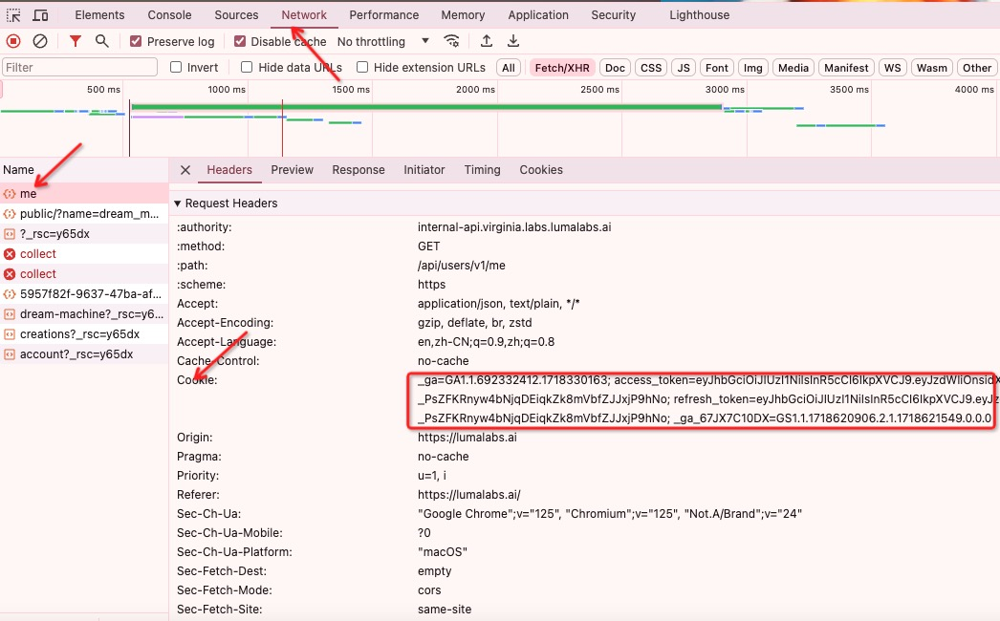

#  Luma API
使用 Golang 将 LumaAI Dream Machine 的视频功能，转换为 API 形式进行调用，便于更快速地集成到第三方系统中。

## 免责声明
- 该项目仅在 GitHub 上以 MIT 许可证发布，免费且开源，仅供学习之用。

# 好消息
提供 Luma API，不需要任何部署，不需要购买 Luma 账户， 更低的价格 & 更好的体验。
网址: https://api.bltcy.ai


## 支持功能
- [x] Luma API 支持视频生成、支持上传携带参考图
- [x] 上传参考图片，可提前上传，也可在提交视频任务时上传第三方图片链接、base64 
- [x] API 接口安全校验
- [x] 简化部署流程，支持 docker-compose、docker
- [x] 提供符合 OpenAI 格式的接口标准化服务，支持流式、非流输出内容
- [x] 支持自定义 OpenAI Chat 返回内容格式，基于 Go Template 语法
- [x] 适配 chat-next-web 等前端项目
- [x] 自动保活（最多7天）
- [] 适配 New API 等中转项目
- [] 敏感词预检测

## 支持接口
- 视频生成，支持上传首尾两张图片
- [x] /generations  
- 视频延长，每次延长5秒
- [x] /generations/:task_id/extend 
- 查询单视频任务
- [x] /generations/:task_id 
- 预上传图片
- [x] /generations/file_upload 
- 获取无水印下载地址
- [x] /generations/:task_id/download_video_url 
- 获取账号订阅信息（余额等）
- [x] /subscription/usage 
- 获取账号信息
- [x] /users/me  


## 对应界面
https://github.com/Dooy/chatgpt-web-midjourney-proxy  
在线体验：    
https://api-chat.gptbest.vip

## API 文档

http://localhost:8000/swagger/index.html

#### 请求示例
```bash
curl --location 'http://localhost:8000/luma/generations/' \
--header 'Authorization: Bearer {SECRET_TOKEN}' \
--header 'Content-Type: application/json' \
--data '{
    "user_prompt": "Increase dynamic",
    "aspect_ratio": "16:9",
    "expand_prompt": true,
    "image_url": "https://api.bltcy.ai/logo.png" 
}'
```

#### 响应示例
```bash
{
    "created_at": "2024-06-18T14:47:43.318498Z",
    "estimate_wait_seconds": null,
    "id": "a4a8f1ff-e59b-4969-abcb-98b3e16f003e",
    "liked": null,
    "prompt": "Increase dynamic",
    "state": "pending",
    "video": null
}
```

## Deployment

### Configuration
在此登录 Google 账户 https://lumalabs.ai/dream-machine/
选择以下其中一种方式获取凭证
1. 从浏览器中获取 cookie


### Env Environment Variables
| 环境变量 | 说明                                                       | 默认值                        |
| --- |----------------------------------------------------------|----------------------------|
| COOKIE | 上图获取的 luma 账号的 cookie     | 空                          | 
| BASE_URL | Luma 官方请求 API URL                                   | https://internal-api.virginia.labs.lumalabs.ai | 
| PROXY | Http 代理                                                  | 空                          | 
| PORT | 开放端口                                                     | 8000                       | 
| SECRET_TOKEN | Luma API 接口安全 Header Bearer token，强烈希望配置                 |  空                        |
| ROTATE_LOGS | 日志是否按天轮转                                                 | 是                          | 
| LOG_DIR | 日志输出路径                                                   | ./logs                     | 
| DEBUG | 是否开启 Debug 日志                                            | 否                          | 
| PPROF | 是否开启 Pprof 性能分析，开启后 8005 端口使用                            | 否                          |
| CHAT_TIME_OUT | Chat 请求超时时间                                              | 600 秒                      |
| CHAT_TEMPLATE_DIR | Chat 模板读取路径                                              | ./template                 |

### Docker Deployment
本教程提供如何使用特定的环境变量及端口映射来运行一个Docker容器的分步指导。为了本指南的目的，敏感信息如SQL名称、密码和IP地址将被替换为占位符。

```bash
docker run --name luma-api -d -p 8000:8000 \
-e COOKIE=xxxx  \
 lumaapi/luma-api
```

docker-compose deployment
```bash
docker-compose pull && docker-compose up -d
```

docker-compose.yml
```bash
version: '3.2'

services:
  sunoapi:
    image: lumaapi/luma-api:latest
    container_name: luma-api
    restart: always
    ports:
      - "8000:8000"
    volumes:
      - ./logs:/logs
    environment:
      - COOKIE=xxxx
```

### Local Deployment
- Golang 1.20+

```bash
git clone https://github.com/LumaAI-API/Luma-API.git
cd Luma-API
go mod tidy
```


## License
MIT © [Luma API](./license)


## 给我买瓶可乐


此项目开源于GitHub ，基于MIT协议且免费，没有任何形式的付费行为！如果你觉得此项目对你有帮助，请帮我点个Star并转发扩散，在此感谢你！
